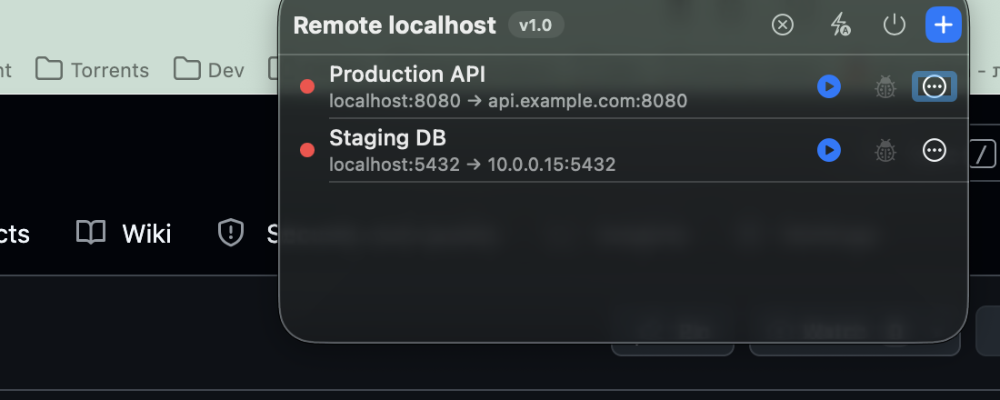
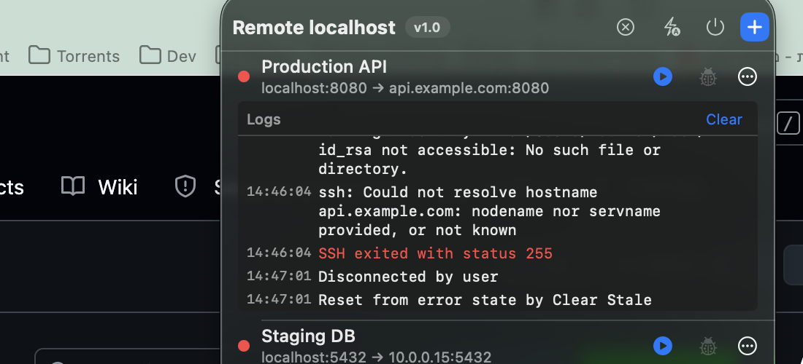
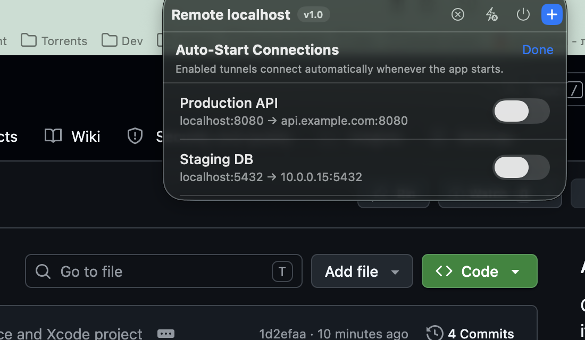

# Remote localhost

A lightweight macOS menu bar app for managing local SSH port-forwarding tunnels — the GUI equivalent of running:

```
ssh -N -L <localPort>:<bindHost>:<remotePort> <user>@<remoteHost> -p <sshPort>
```

without keeping a terminal window open.

<p align="center">
  <br>
  <br>
  
</p>

## Features

- Menu bar only — no dock icon, no main window.
- Multiple named tunnels, each with its own host, ports, and credentials.
- Auth via SSH key (with optional passphrase) or password — connects non-interactively, no terminal prompts.
- Configurable remote bind host (`127.0.0.1`, `localhost`, or a custom address).
- Live status per tunnel with logs for debugging auth/forwarding failures.
- Optional auto-start per tunnel on app launch.
- "Clear Stale" cleans up dead tunnels and orphaned SSH processes.
- Tunnels persist across launches.

## Requirements

- macOS 13.0+
- Xcode 15+ to build

## Build & Run

1. Open `RemoteLocalhost.xcodeproj` in Xcode.
2. Select the `RemoteLocalhost` scheme and hit **Run** (or **Archive** for a Release build).
3. Click the globe icon in the menu bar, then `+` to add a tunnel.

Or just grab the latest build from [Releases](../../releases) — built and published automatically by CI on every `vX.Y.Z` tag.

## Notes

- SSH runs with `StrictHostKeyChecking=no` for convenience with hosts you already trust.
- Passwords/passphrases are written briefly to a one-shot, `0700`-permissioned `SSH_ASKPASS` script in `/tmp`, then deleted.
- Tunnel configs (including passwords/passphrases) are stored in plaintext via `UserDefaults` — prefer SSH key auth if that's a concern.
